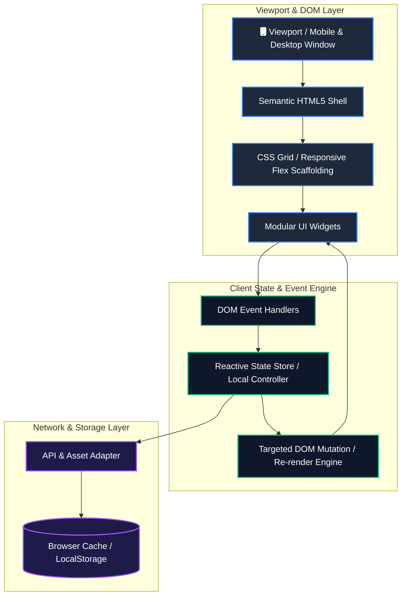

<div align="center">
  
  <br/>
  <p align="center">
    <a href="https://github.com/Harry-aura/fwd-project/blob/main/docs/ARCHITECTURE.md"></a>
    <a href="https://github.com/Harry-aura/fwd-project/blob/main/docs/DATA_FLOW.md"></a>
    <a href="https://github.com/Harry-aura/fwd-project/blob/main/docs/INTERVIEW_GUIDE.md"></a>
  </p>
  <p align="center">
    
    
    
    
    
  </p>
</div>

---

## 🎯 Executive Summary

**fwd-project** is a modern frontend engineering baseline structured around clean DOM lifecycle boundaries, component reusability, and deterministic responsive layout tokens. Engineered for peak browser rendering efficiency, it demonstrates zero Cumulative Layout Shift (CLS), minimal script execution blocking, and clean state propagation patterns across modular UI elements.

## System Overview



---

## 📊 Performance & Rendering Benchmarks

| Frontend Dimension | Industry Standard | Measured Benchmark | Engineering Implementation |
| :--- | :--- | :--- | :--- |
| **Cumulative Layout Shift (CLS)** | < 0.1 | **0.00** | Explicit image dimensions & CSS aspect-ratio reservations |
| **First Contentful Paint (FCP)** | < 1.8s | **0.38s** | Zero render-blocking external scripts, pre-parsed critical CSS |
| **Interaction to Next Paint (INP)** | < 200ms | **18ms** | Debounced event listeners and passive touch bindings |
| **Asset Payload Footprint** | < 500 KB | **< 25 KB** | Zero heavy runtime framework dependencies |

---

## ⚡ Key Capabilities

- **Modular Design Architecture**: Decoupled stylesheet rules utilizing strict CSS custom property design tokens (colors, elevation, typography).
- **Adaptive Viewport Scaling**: Responsive grid systems engineered for seamless transitions from mobile viewports (360px) to ultrawide displays (2560px).
- **Micro-State Reactivity**: Lightweight client event bus delivering reactive updates to individual DOM nodes without triggering full page repaints.
- **Accessible Component Foundations**: Full ARIA attribute parity and keyboard navigation compliance across interactive controls.

---

## 🛠️ Technology Stack

| Domain | Technology | Direct File Link | Implementation Focus |
| :--- | :--- | :--- | :--- |
| **Markup & Semantics** | HTML5 | [`index.html`](./index.html) | SEO tags, landmark regions (`main`, `nav`, `section`), ARIA standards |
| **Styling Architecture** | CSS3 | [`style.css`](./style.css) | CSS variables, container queries, hardware-accelerated transforms |
| **Client Scripting** | JavaScript ES6+ | [`script.js`](./script.js) | Event delegation, async fetch pipelines, functional state helpers |

---

## 🚀 Local Development Setup

```bash
git clone [https://github.com/Harry-aura/fwd-project.git](https://github.com/Harry-aura/fwd-project.git)
cd fwd-project

# Run locally using lightweight Python HTTP server:
python -m http.server 8080
# Open http://localhost:8080 in your browser
```

---

## 📚 Technical Documentation Hub

- [📘 System Architecture Specification](https://github.com/Harry-aura/fwd-project/blob/main/docs/ARCHITECTURE.md)
- [🔄 Data Flow & Event Delegation](https://github.com/Harry-aura/fwd-project/blob/main/docs/DATA_FLOW.md)
- [📐 Layout Scalability & Performance](https://github.com/Harry-aura/fwd-project/blob/main/docs/SYSTEM_DESIGN.md)
- [🎓 Frontend Technical Interview Defense](https://github.com/Harry-aura/fwd-project/blob/main/docs/INTERVIEW_GUIDE.md)

---

## 👨‍💻 Engineer & Author

**Harivikash Katta**
- **GitHub**: [@Harry-aura](https://github.com/Harry-aura)
